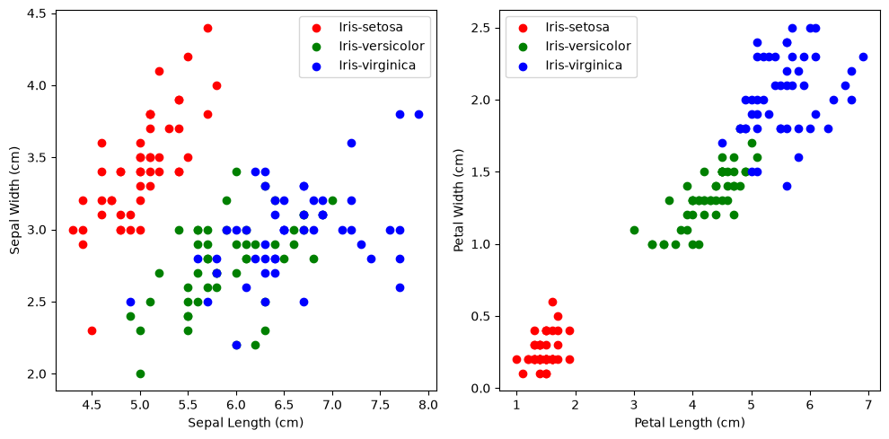
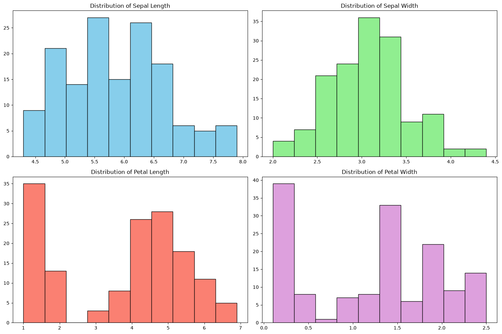
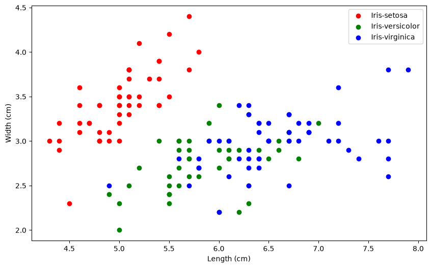

# Iris Flower Classifier

In this project, I classify iris flowers into three species: **setosa**, **versicolor**, and **virginica** using their sepal and petal measurements. I trained two classifiers (KNN and SVM) on the [UCI Iris dataset](https://www.kaggle.com/datasets/uciml/iris) and compared their accuracy.

## Preprocessing

Dropped the irrelevant `id` column, removed three duplicate rows, one-hot encoded `Species` into three binary integer columns, and split the data into 80/20 train-test split.

## Exploratory Data Analysis

I generated three visualizations to understand feature distributions and species separability.

### Comparing Sepal and Petal Measurements

The petal plot shows much clearer species separation than the sepal plot, setosa clusters distinctly in the bottom-left, while versicolor and virginica overlap more in sepal space.

Petal measurements are far more useful for classification than sepal measurements. In the right panel, setosa forms a tight, completely isolated cluster, making it trivially separable. Versicolor and virginica overlap at the boundary. In contrast, the sepal scatter shows all three species jumbled together, confirming that sepal features alone would make a poor classifier.

### Feature Distributions

Petal length and petal width both show bimodal distributions, while sepal measurements are more normally distributed.

The petal length histogram has a clear gap between ~2 and ~3 cm, that gap is the boundary between setosa and the other two species. This explains why even simple classifiers perform well on this dataset: there's a natural separation in the data. The sepal histograms, on the other hand, are roughly unimodal with heavy overlap across species, confirming my earlier observation that sepal features contribute less to classification.

### Sepal Dimensions by Species

Setosa occupies the upper-left region, shorter sepals but relatively wider while virginica tends toward the right with longer sepals. The problem is versicolor, which sits right in the middle and bleeds into both neighboring clusters. If I had to classify using only sepal dimensions, I'd struggle with versicolor/virginica confusion. This plot reinforced my decision to use all four features for the classifiers rather than relying on sepal measurements alone.

## Models and Results

| Model | Accuracy | Precision | Recall | F1-Score |
|-------|----------|-----------|--------|----------|
| **KNN** | 93.3% | 0.93 | 0.93 | 0.93 |
| **SVM** | 96.7% | 0.97 | 0.97 | 0.97 |
